# 📑 Rapport de Penetration Test : Machine "Overwatch"

---

## 1. 🌍 Reconnaissance & Scan Réseau

La première étape consiste à cartographier la surface d'attaque, je ne sais pas a quoi m'attendre, je fais donc un full scan avec un timing plutôt rapide et stable..

**Commande Nmap :**

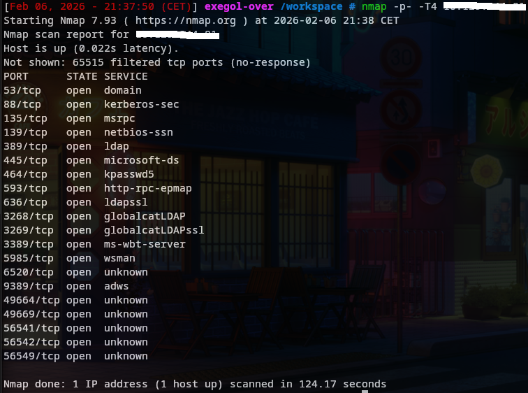
Après un scan complet des ports, je me retrouve face à un environnement très verbeux. La présence des ports **53 (DNS), 88 (Kerberos), 389 (LDAP)** et **445 (SMB)** confirme sans aucun doute que nous sommes face à un **Contrôleur de Domaine (Active Directory)** Windows.

En parcourant la liste, la plupart des ports sont standards pour un AD. Cependant, le port **6520/tcp** marqué comme `unknown` attire mon attention. Il ne correspond à aucun service Windows standard (qui se trouvent généralement dans les ports dynamiques RPC hauts, 49xxx). C'est une anomalie qu'il faudra creuser, car cela ressemble à un service déplacé manuellement par un administrateur.

---
## 2. 🔍 Énumération SMB & Analyse Statique

Avant de m'attaquer au port exotique 6520, je décide de vérifier les classiques. Le port **445 (SMB)** est souvent une mine d'or sur les machines Windows. J'ai donc lancé une énumération des partages (avec `smbclient`) pour voir si l'accès anonyme ou invité était permis

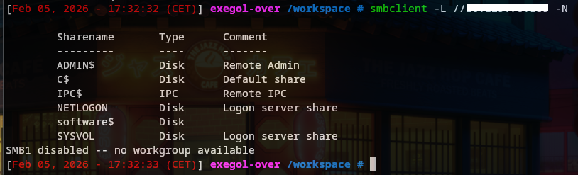

Bingo ! J'ai découvert un partage non standard nommé `software$` qui était accessible. À l'intérieur, j'ai trouvé `overwatch.exe` et `overwatch.exe.config` que j'ai immédiatement exfiltrés pour analyse locale.

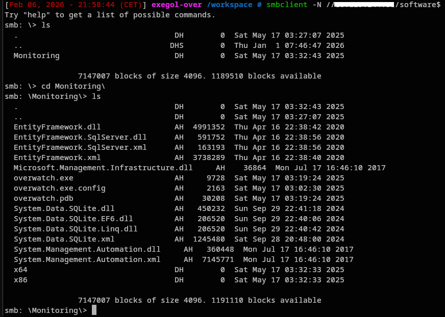)

Une fois les deux exécutables exfiltrés sur ma machine locale, je passe à l'analyse. Plutôt que de risquer une exécution, j'utilise l'utilitaire strings pour extraire les chaînes de caractères imprimables et voir si des informations sensibles ont été codées en dur.

Le premier fichier `overwatch.exe.config` ne donne rien de concluant pour le moment. En revanche, l'analyse du second fichier est fructueuse. Je repère ce qui ressemble fortement à une paire d'identifiants en clair.

On utilise l'option `-el` pour lire l'Unicode Windows.


Credentials : `sqlsvc:TI0LKcfHzZw1Vv`

## 3. 🛠️ Exploitation MSSQL & Mouvement Latéral

Nous disposons via une phase précédente de collecte des identifiants :

* **User :** `sqlsvc`
* **Pass :** `TI0LKcfHzZw1Vv`

### Test de connexion Evil Win-RM

Mon premier réflexe est de tenter d'obtenir un shell système stable. Le scan Nmap ayant révélé que le port 5985 (WinRM) était ouvert, je lance Evil-WinRM pour essayer de m'y connecter.

Malheureusement, la tentative échoue. L'utilisateur récupéré ne semble pas faire partie du groupe "Remote Management Users", ce qui m'interdit l'accès à distance via ce protocole.

Je change donc de stratégie. Je me rappelle que le scan initial montrait un service MSSQL déporté sur le port 6520. Puisque les identifiants proviennent d'un exécutable (probablement une application cliente de base de données), il est très probable que ces accès soient destinés au serveur SQL.

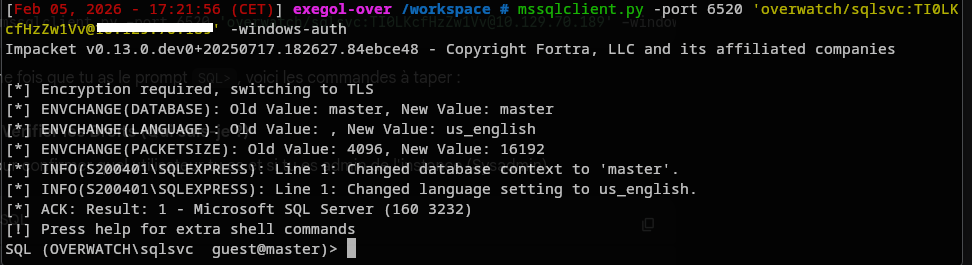

Une fois connecté au service MSSQL sur le port 6520, ma priorité est d'évaluer mes droits pour voir si je peux activer `xp_cmdshell`. La commande `SELECT SYSTEM_USER` m'indique que je suis connecté avec le compte de service `OVERWATCH\sqlsvc`.

J'espère un instant être administrateur, mais la commande `SELECT IS_SRVROLEMEMBER('sysadmin')` me renvoie un triste 0, confirmant que je n'ai pas les privilèges élevés nécessaires. Une vérification plus fine via `fn_my_permissions` montre que je suis cantonné aux droits basiques : `CONNECT SQL` et `VIEW ANY DATABASE`.


Je profite de ce droit de lecture pour lister les bases de données. Outre les bases systèmes (master, tempdb, etc.), je note la présence d'une base spécifique nommée overwatch. Cependant, sans droits d'exécution système, je suis dans une impasse locale.


Je cherche alors des ponts vers d'autres machines (Mouvement Latéral). J'exécute la procédure stockée `EXEC sp_linkedservers` pour voir si ce serveur SQL communique avec d'autres.


Bingo ! La commande me retourne la présence d'un serveur lié nommé `SQL07` (en plus d'une instance locale `S200401\SQLEXPRESS`). C'est ma nouvelle cible pour tenter de m'échapper de ce contexte restreint.

## 4. 🎣 Forced Authentication (Relay / Capture NTLM)

Ayant découvert le serveur lié `SQL07`, j'exploite cette relation de confiance pour effectuer une attaque de type **Forced Authentication**.

Le vecteur d'attaque repose sur la procédure stockée `master..xp_dirtree`. Cette fonction est conçue pour lister le contenu d'un répertoire. Sa vulnérabilité réside dans sa capacité à accepter des chemins réseaux au format UNC (`\\IP\Partage`).

Lorsqu'un système Windows tente d'accéder à un chemin UNC distant, le protocole SMB initie automatiquement un processus d'authentification (Challenge/Response) pour valider les accès. En spécifiant l'adresse IP de ma machine d'attaque comme cible, je force le service SQL distant à se connecter à moi et à me livrer ses identifiants.

Je prépare d'abord **Responder** sur mon interface réseau pour intercepter cette connexion entrante. Ensuite, j'injecte la commande malicieuse via le lien SQL


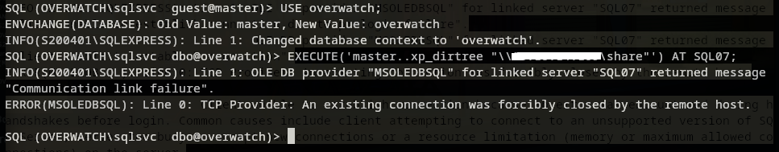

L'attaque fonctionne instantanément. Le serveur `SQL07` tente de s'authentifier sur mon faux partage réseau. Responder intercepte la communication et, en raison d'une configuration de sécurité faible sur la cible ou le protocole utilisé, capture le mot de passe en clair (Cleartext) de l'utilisateur exécutant le service SQL distant : `sqlmgmt`


Credentials : `sqlmgmt:bIhBbzMMnB82yx`

## 5. 🦶 Accès Initial : Foothold via WinRM

Nous disposons via une phase précédente de collecte des identifiants :

* **User :** `sqlmgmt`
* **Pass :** `bIhBbzMMnB82yx`

### Test de connexion SQL

Avec les identifiants de l'utilisateur **`sqlmgmt`** en ma possession, je tente d'abord de me reconnecter au service MSSQL pour voir si mes privilèges ont augmenté.

C'est une déception : bien que l'authentification réussisse, ce nouvel utilisateur semble avoir encore moins de droits que le précédent dans le contexte SQL. Je n'ai toujours pas accès à `xp_cmdshell` et, pire, l'accès à la base de données `overwatch` m'est désormais refusé. Ce compte ne semble pas être destiné à la gestion de la donnée (Data), mais plutôt à la gestion du serveur (Management).

Je me tourne alors vers l'accès distant via **WinRM** (Port 5985), qui avait échoué précédemment. Le nom `sqlmgmt` laisse espérer une appartenance au groupe "Remote Management Users".

### Test de connexion Système (WinRM)

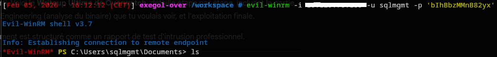

Bingo ! J'obtiens instantanément un shell PowerShell stable sur la machine.

Je navigue immédiatement dans les répertoires de l'utilisateur pour sécuriser le premier objectif. Le fichier `user.txt` se trouve, comme d'habitude, sur le bureau.

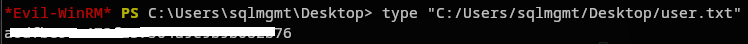

---
## 6. ⚡ Élévation de Privilèges (PrivEsc) : De User à SYSTEM

#### 1. Reconnaissance Interne & Lien avec le Scan Initial

Une fois l'accès utilisateur validé, je commence l'énumération du système de fichiers à la recherche de configurations atypiques. En listant la racine du disque `C:\`, un dossier caché attire mon attention :

```powershell
ls -Force C:\
```

Je découvre le dossier **`C:\Software`**. En explorant `C:\Software\Monitoring`, je trouve un binaire nommé **`overwatch.exe`** et son fichier de configuration **`overwatch.exe.config`**.

#### 2. Analyse de la Configuration (Le Service Caché)

Plutôt que de faire du reverse engineering complexe sur l'exécutable, je décide d'inspecter son fichier de configuration `.config` pour comprendre son comportement. J'utilise la commande `strings` pour en lire le contenu.

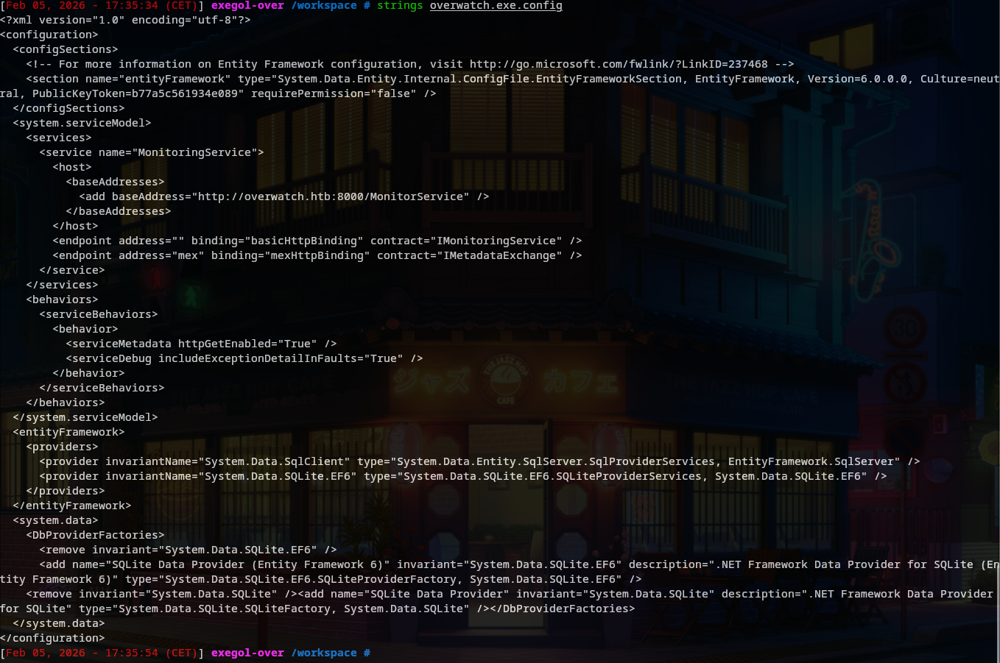

> _"L'analyse du fichier `overwatch.exe.config` révèle une information critique : l'application expose un service WCF (Windows Communication Foundation) écoutant en local sur le port 8000."_

La ligne clé est : `<add baseAddress="http://overwatch.htb:8000/MonitorService" />`.

Comme ce service est lancé depuis un dossier système protégé, il est très probable qu'il tourne avec les privilèges **SYSTEM**.

#### 3. Analyse de la Vulnérabilité (Command Injection)

Le service expose une méthode nommée `KillProcess`. En informatique, les fonctions qui gèrent des processus système à partir d'une entrée utilisateur (ici le nom du processus) sont souvent vulnérables aux injections de commandes si les entrées ne sont pas "sanitized" (nettoyées).

Mon hypothèse est la suivante : le code backend construit probablement une commande PowerShell dynamique du type `Stop-Process -Name $Input`. Si je parviens à fermer cette commande et à en chainer une autre, je peux exécuter du code en tant que SYSTEM.

#### 4. Exploitation via SOAP

Je construis une requête SOAP malveillante dans un fichier nommé `pwn.xml`.

L'objectif est d'injecter une commande pour m'ajouter au groupe des administrateurs locaux.

**Le Payload :**

```plaintext
nothing; net localgroup administrators sqlmgmt /add
```

_Le `;` sert de séparateur de commandes en PowerShell._

> _"Je prépare l'enveloppe SOAP en insérant mon payload dans la balise `<tem:processName>`."_

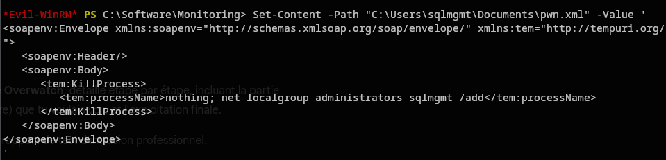

J'envoie ensuite cette requête au service local via `curl` (alias de `Invoke-WebRequest` en PowerShell) :

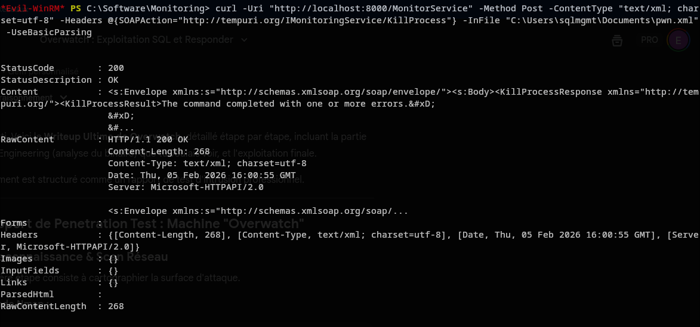

> _"Le serveur répond avec un code 200 OK. Bien que le corps de la réponse contienne une erreur (car le processus 'nothing' n'existe pas), cela confirme que ma commande a été traitée."_

#### 5. Validation et Problème de Jeton (Token)

Je vérifie immédiatement si l'exploitation a fonctionné en listant les membres du groupe administrateur.

> _"Succès ! L'utilisateur `sqlmgmt` apparaît désormais dans le groupe **Administrators**."_

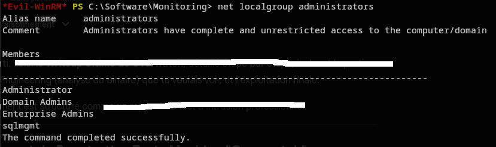

Cependant, sous Windows, l'appartenance à un groupe est définie dans le **Security Token** généré au moment de la connexion (Logon). Même si je suis admin dans la base de données locale, ma session actuelle utilise l'ancien jeton (utilisateur standard). Je ne peux donc pas encore lire le fichier `root.txt`.

## 7. 🚩 Capture du Flag Root

Pour régénérer mon jeton avec les nouveaux droits, je dois me déconnecter et me reconnecter.

> _"Je ferme ma session Evil-WinRM avec `exit`, puis je me reconnecte immédiatement avec les mêmes identifiants. Cette nouvelle session bénéficie du jeton Administrateur. Je peux enfin accéder au bureau de l'Administrateur et capturer le flag final."_

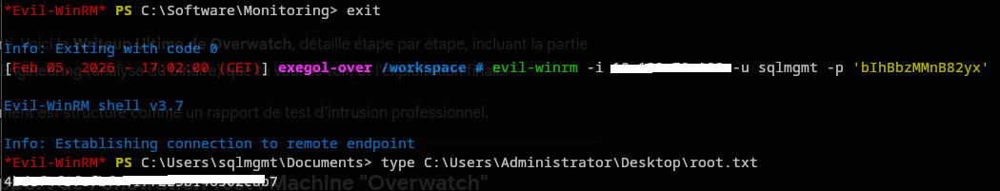

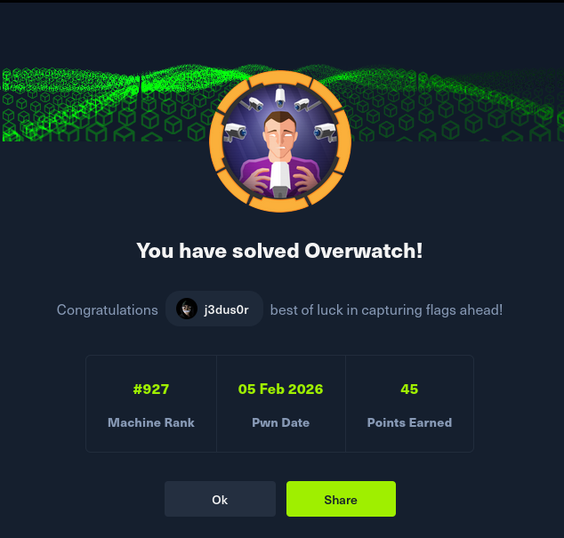

## 🎓 Résumé Technique & Leçons Apprises

1. **Énumération approfondie :** `ls -Force` est vital sur Windows pour voir les dossiers cachés par les admins.
2. **Reverse Engineering basique :** `strings -el` sur les binaires .NET est une technique puissante pour trouver des mots de passe en dur ou des endpoints cachés.
3. **WCF / SOAP :** Ces vieux protocoles sont souvent vulnérables aux injections car ils sont considérés comme "internes" et de confiance.
4. **Syntaxe PowerShell vs CMD :** L'échec initial avec `&` montre l'importance de savoir quel interpréteur exécute notre code (ici PowerShell utilise `;`).
5. **Gestion des Groupes Windows :** L'ajout à un groupe nécessite toujours une reconnexion.
